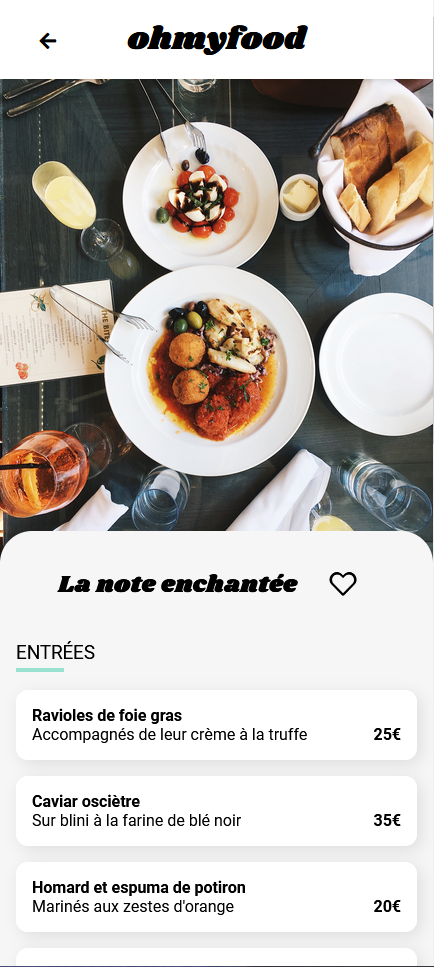
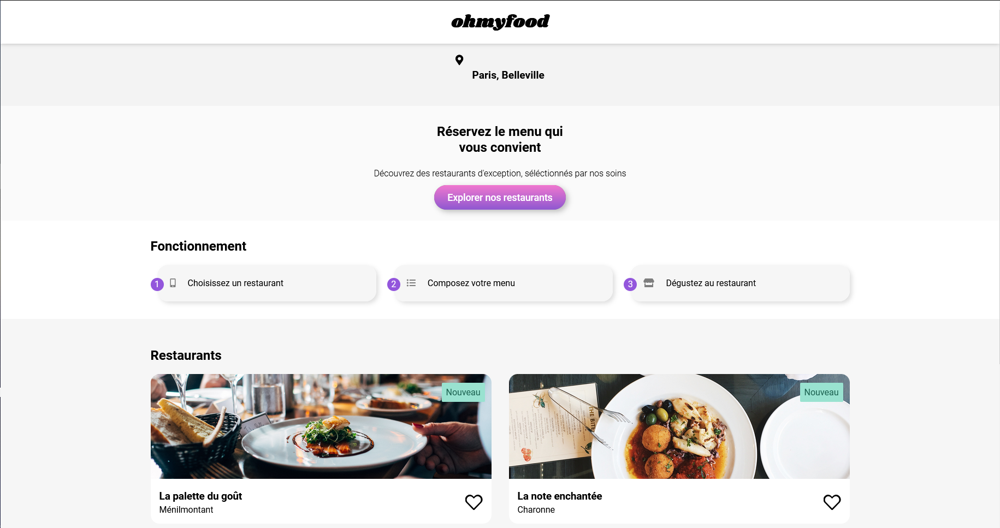
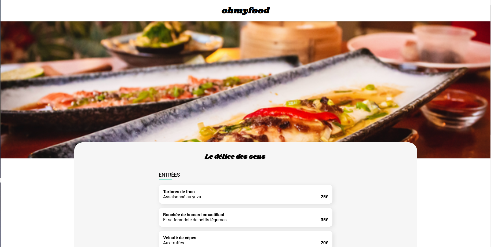

## OC projet OMF ##

Find exceptional restaurants and compose your menu and enjoy !
Thanks to a web application available everywhere.

This web application is coded in html5 and css3, no framework just from scratch !

  

## Screenshots

<!--  -->

### Installation ###

* type `git clone https://github.com/NoirLezard/OCprojetOMF projectname` to clone the repository
* type `cd projectname`

It's done !

http://localhost/projectname

A user has been created for you with the following login credentials:
* login: nologin
* password: nopassword

### Hosting ###

#### Licensing
OC projet OMF is licensed under the [GNU v3 Public License](#).
In addition to the terms set by the GNU v3 Public License, we ask that if you use any code from this repository that you send us a message to let us know.